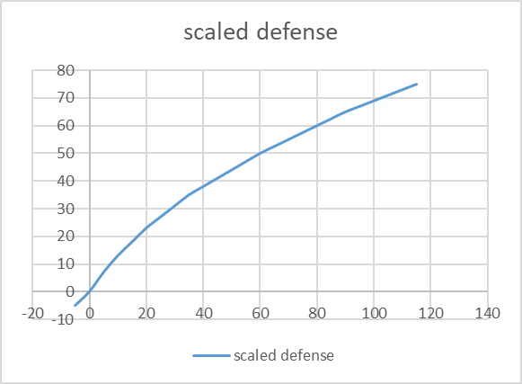

# And Justice for All

This Battle Brothers mod is an attempt to rebalance the perks and attributes
to make more build paths good and open more options for near-optimal play.

## Minmaxing

Melee/Ranged attack and melee defense dominates character development resulting
generally in the simple rules:  
* 1 melee defense > 1 melee attack > 2 hitpoints/max fatigue/resolve
* 1 melee attack > 3 initiative

### Melee Defense: The Elephant in the Room
Defense scales too well. For example going from 10% to 5% chance to be hit
effectively reduces in half the damage taken. On the other hand investing in it
a little is not very good. This effect is already dampened with defense above 50
being halfed, but it is not enough.

Attack skill has the inverse property and has diminishing returns with respect
to damage output. When hit chances are low additional skill is very beneficial.
On the other hand he difference in damage output between 90% and 95% hit chance is small.
It does reduce unpredictability though and killing the enemy fast is important.

## Changes

### Secondary Attributes Leveling

With this mod hitpoints, maximum fatigue and resolve level up ranges have been increase
from [2, 4] to [2, 6]. Initiative's range has been also increased to [3, 7].
Talent stars on them give +2 on level ups, making them more important in a
similar way to primary attribute talents.
With this change you will more often have to make the choice between +6 on a secondary
attribute or +2 on a primary attribute.
The +2 on a primary attribute will maybe still majorise other level ups,
but at least you will feel bad for passing on a +6 :).

It is worth noting, that attribute level-up values are generated when the player object is
created. In old saves, characters that have been created already,
either being hired or are available to hire, would not benefit from the buff.

### Defense
Defense calculation is changed such that defense below 30 is increased
and above 30 is decreased.

With this change you gain more hit chance
reduction when defense is low and less the higher it gets when compared
to the vanilla formula.

### Shieldwall
The neighbor shieldwall bonus is buffed from +5 to +7.  
With this change it is more beneficial to shieldwall on the entire front line
instead of just on the flanks.

### Shields
Melee and ranged defense of all shields is increased by 1.
With the nerfed scaling of defense shields needed some love and they
are generally weaker compared to double gripping, usually useful only on
dedicated tanks.

### Two-handed Melee Weapons
Reduced the min damage by 5% of the average damage of 2H melee weapons.  
Generally 1H melee weapons are inferior to 2H weapons. This small nerf may make
duelist and shield+1H more attractive.

### Player Banner

The mechanic of the banner has been changed to give 10% of the resolve of the bearer
to another character, if adjacent directly to him.
The bonus falls off with each tile of distance by 2%.
The maximum distance that  the bonus is active is at 5 tiles away.
The bonus then is 2%. The standard also must be in the vision radius to receive the bonus.
For example wearing -3 vision helmet at night would result in 2 vision radius
making it much harder to get the bonus.  
The wings would receive much lower bonus if the banner stays at the middle,
you may have to be more strategic where you place the banner to maximize the local
effect by foregoing another part of the battlefield.

### Perks

* **Fast Adaptation** - Buffed from 10% hit chance per stack to 12%. This perk
is usually picked on fodder bros and late game bros would generally get
little from this perk. Maybe 3% hit chance increase on average. This Buff makes
it a bit likely that this perk will dominate the development of fodder bros. I think
it is more important to have balance for good characters.
* **Crippling Strikes** - Buffed from 33% injury threshold reduction to 40%.
This perk finds little use because a lot of enemies are immune to injuries or
very hard to injure like Unholds.
With this change the perk becomes quite good against them.
1H duelists can also injure more consistently other humans.  
Many enemies would be harder since they have this perks, like Unholds and Barbarians.
* **Colossus** - Nerfed from 25% hitpints bonus to 20%.
This perk seemed too strong and a part of 95% of builds.
Even an auto-pick on backliners because of its synergy with Nimble.
Although, Adrenaline is a viable first pick due to the explosive nature of early fights
and having lower initiative than opponents in the very early game,
Colossus usually finds its way into a build almost always.
With the hitpoints leveling buff it is less important to take Colossus.
Probably, the nerf is not strong enough to justify skipping it since survival
is very important for your characters.
* **Nine Lives** - Buffed to give +20 instead of +15 to melee defense, ranged defense, resolve and initiative.
Also the effect is active for 2 turns instead of until next turn only.  
Nine Lives is only picked on disposable characters or maybe on a swordmaster if
he has really poor hitpoints. Hopefully, this change would make it viable on more builds.
Necrosavants would be tougher to finish off now.
* **Bags and Belts** - Buffed to decrease the maximum fatigue penalty of 2H weapons by 50%.
With this buff caring 2 2H weapons in the bag would save around 7 maximum fatigue.
* **Adrenaline** - Buffed to cost 18 fatigue instead of 20.  
This perk is good especially early game, but falls off later.
In Blazing Deserts there are more character backgrounds with smaller fatigue pools
and movement in the desert is really taxing on fatigue, so Adrenaline is less viable.
* **Executioner** - Buffed the damage multiplier when attacking injured targets from 20% to 25%.  
Although, not as bad as Crippling Strikes, Executioner is rarely justified picking up.
Some opponents like Barbarian Chosen and raiders would also benefit from the buff.
* **Bullseye** - Buffed from 50% block penalty reduction to 40%.  
Sniper build are generally inferior since they have much reduced damage output.
This perk change would buff them a bit.  
Some enemies like Goblins would also benefit of the buff.
* **Gifted** - I wanted to nerf it considering also the max levelup to secondary
attributes is higher, but I couldn't come up with an alternative.
* **Anticipation** - Buff of per-tile ranaged defense bonus from 10% to
15% of your ranged defense.  
Aside from Goblin City, Anticipation would be rarely justified to be picked up.
Goblin Ambushers also have Anticipation and 20 ranged defense, so they are not
much easier to fight with this buff if you have the perk also.
* **Taunt** - Reduced the AP cost from 4 to 3.
With this buff Taunt could be cast 3 times per turn in the clutch moments.
Doing this multiple turns would be too taxing on fatigue.
* **Polearm Mastery** - Nerfed the fatigue reduction from 25% to 16%.  
With this change doing a basic attack with a polearm and the mastery costs 13
fatigue instead of 12.  
Polearm mastery is really strong because it reduces the AP cost to 5, making 
even company builds where everyone has just Polearm Mastery quite good. This nerf
forces you to sacrifice some fatigue. The nerf is probably not strong enough,
except for special attacks that are heavy on fatigue.
For example Reap would cost 25 with mastery instead of 23.
* **Throwing Mastery** - Nerfed to do 22% more damage at distance of 2 and 12% at distance of 3.
Now without mastery there is a 15% damage bonus at distance of 2 and 7.5% damage bonus at distance of 3.
The total damage increase with mastery is again 40% and 20% at 2 and 3 tiles distance respectively.  
I tried several times to do a skirmisher build, but it sucked.
Due to this throwing damage without mastery from 2 and 3 tiles away is buffed.
Now Goblin Skirmishers, Barbarian Reavers, etc. are stronger. As Reavers needed any buffs :).
Overall with the Bullseye buff leveling ranged defense is more important.
* **Reach Advantage** - Buffed to give +6 melee defense per stack instead of +5.  
Although, melee defense is very important, Reach Advantage looks inferior to Underdog,
since it is much less consistent and is lost when switching weapons.
It is also applied before scaling down defense, while underdog is always a flat
-5% chance to hit.
Hopefully this buff does not force you to always pick both.
* **Footwork** - Reduced the fatigue cost from 25 to 20.  
This perk is way too taxing on fatigue for the utility it provides.
* **Head Hunter** - Buffed to give also +5% to hit chance when the first hit proks.  
This change makes it easier to land the guaranteed second hit on the head.  
Necrosavants would be even more scary :).
* **Nimble** - Nerfed to provide at best 50% hitpoints damage reduction instead of 40%.  
* **Battle Forged** - Nerfed to provide armor damage reduction equal to 4% of
total armor. Reduced from 5%.  
Nimble or Battle Forged are always picked and are must-have perks that dominate
any character build. They are the most powerful perks in the game. Maybe aside
from Berserk. Berserk is much harder to balance though, because of its mechanics.
It will be much weaker on 1-heanders if it provided only 3 AP on a kill,
crippling the whole class. Therefore, Berserk is the yardstick for late-game perks.
The nerf to Nimble and Battle Forged is probably not significant enough to justify
not picking any of them. I am afraid that nerfing them further would break the
game, making it significantly harder to survive.

### Entity and Party Strength
NPC strength has been rebalanced to reflect the perk changes.  
Player character strength calculation has been changed to reflect the bonus
to secondary attributes per level. With each level the strength is increase by 2.1
instead of 2.

### Feedback

I would be happy to get your feedback on how to improve the balance more.

## Dependencies

* [Battle Brothers](http://battlebrothersgame.com/) (=1.4.0.48)
* [modhooks](https://www.nexusmods.com/battlebrothers/mods/42) (>=20)
* [libreuse](https://github.com/sogartar/libreuse) (>=0.2)
